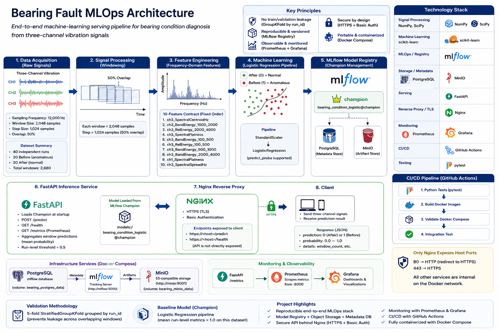
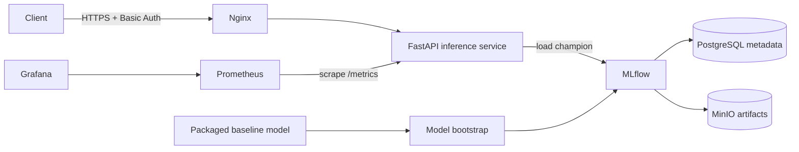

# Bearing Fault MLOps

[](https://github.com/ahmadtza/bearing-fault-mlops/actions/workflows/ci.yml)

An end-to-end machine-learning serving and MLOps stack for **bearing condition diagnosis from three-channel vibration signals**. The project combines signal-processing feature extraction, a scikit-learn classification pipeline, MLflow Model Registry, PostgreSQL, MinIO, FastAPI, Nginx, Prometheus, Grafana, Docker Compose, and GitHub Actions.

## Key Features

- End-to-end bearing condition diagnosis from raw three-channel vibration signals.
- Leakage-aware validation using grouped cross-validation by independent physical run.
- Reproducible frequency-domain feature engineering with a fixed production feature contract.
- Scikit-learn inference pipeline managed through the MLflow Model Registry.
- PostgreSQL metadata storage and MinIO artifact storage for MLflow.
- FastAPI inference service with Champion model loading at application startup.
- Nginx reverse proxy with HTTPS and Basic Authentication.
- Prometheus metrics and Grafana monitoring.
- Containerized deployment with Docker Compose and persistent infrastructure volumes.
- Idempotent model bootstrap for reproducible deployment from a fresh environment.
- GitHub Actions CI covering Python tests, Docker builds, Compose validation, and full integration testing.

## Technology Stack

| Layer | Technologies |
|---|---|
| Signal processing | NumPy, SciPy |
| Machine learning | scikit-learn |
| Model tracking and registry | MLflow |
| API and serving | FastAPI, Uvicorn |
| Metadata store | PostgreSQL |
| Artifact storage | MinIO |
| Reverse proxy and TLS | Nginx |
| Monitoring | Prometheus, Grafana |
| Containerization | Docker, Docker Compose |
| CI/CD | GitHub Actions |
| Testing | pytest |

The packaged baseline model distinguishes:

- **Before** (`1`) — anomalous bearing condition
- **After** (`0`) — normal/repaired bearing condition

> **Scope:** this repository is designed to demonstrate a reproducible local MLOps/serving workflow. The reported validation results are dataset-specific and must not be interpreted as proof of performance on unseen machines, operating regimes, sensors, or fault mechanisms.

## Architecture




The diagram above summarizes the complete serving architecture, from vibration-signal processing and the fixed production feature contract to MLflow Champion management, secure API serving, observability, and CI/CD.




Only **Nginx** publishes host ports (`80` and `443`) in the default Compose configuration. FastAPI, MLflow, PostgreSQL, MinIO, Prometheus, and Grafana remain internal to the Docker network.

## Machine-learning methodology

The training dataset contains **40 independent runs** and **2,680 overlapping signal windows**:

| Item | Value |
|---|---:|
| Sampling frequency | 12,000 Hz |
| Window size | 2,048 samples |
| Step size | 1,024 samples |
| Window overlap | 50% |
| Before/anomalous runs | 20 |
| After/normal runs | 20 |
| Total runs | 40 |
| Total windows | 2,680 |

A random window-level split is inappropriate for strongly overlapping/adjacent vibration windows because windows from the same physical run can leak information across train and validation sets. The final validation protocol therefore uses **5-fold `StratifiedGroupKFold` grouped by `run_id`**.

### Model results

The final model comparison was performed using leakage-aware grouped validation, with `run_id` used to keep windows from the same physical recording in the same fold.

| Model | Window Accuracy | Window F1 | Run Accuracy | Run F1 |
|---|---:|---:|---:|---:|
| Logistic Regression | 0.8216 | 0.8207 | **1.0000** | **1.0000** |
| Random Forest | 0.8672 | — | 0.9750 | 0.9778 |
| SVM (RBF) | **0.8709** | — | **1.0000** | **1.0000** |

Logistic Regression was selected as the packaged baseline Champion because it achieved perfect run-level classification under the grouped validation protocol while retaining a simpler and more interpretable model structure.

> **Important:** the run-level results are dataset-specific. They do not establish generalization to unseen machines, bearings, sensors, loads, speeds, or fault mechanisms.

The packaged Logistic Regression pipeline achieved mean run-level Accuracy, Precision, Recall, F1, ROC-AUC, and PR-AUC of **1.0** under that group-aware cross-validation protocol. These results characterize this dataset and validation design only; external validation is still required before any real-world diagnostic or maintenance decision.

### Production feature contract

Inference uses ten frequency-domain features in this exact order:

1. `ch3_SpectralCentroidHz`
2. `ch3_BandEnergy_1000_2000`
3. `ch3_RelEnergy_2000_4000`
4. `ch3_SpectralFlatness`
5. `ch3_BandEnergy_100_500`
6. `ch3_RelEnergy_100_500`
7. `ch3_BandEnergy_500_1000`
8. `ch3_BandEnergy_2000_4000`
9. `ch1_SpectralFlatness`
10. `ch3_SpectralSpreadHz`

`feature_engineering.py` applies the same sampling frequency, windowing parameters, and feature definitions used by the serving contract. The API aggregates window-level anomaly probabilities using their mean and applies a run-level threshold of `0.5`.

## Model bootstrap and registry

A small baseline model package is intentionally tracked in Git:

```text
models/
├── bearing_logistic_pipeline.joblib
├── model_metadata.json
└── selected_features.json
```

These files are **bootstrap artifacts**, not the runtime registry itself. On a fresh deployment, `scripts/bootstrap_mlflow.py` validates the packaged model and feature contract, registers the model in MLflow, and assigns the `champion` alias.

The FastAPI service then loads the runtime model from:

```text
models:/bearing_condition_logistic@champion
```

Bootstrap is idempotent when a Champion already exists. If the registered model exists but the `champion` alias is missing, bootstrap stops instead of silently modifying a partially configured registry.

## Services

| Service | Role | Default host exposure |
|---|---|---|
| Nginx | TLS termination, Basic Auth, reverse proxy | `80`, `443` |
| FastAPI | Feature extraction and model inference | Internal only (`8000`) |
| MLflow | Tracking server and Model Registry | Internal only (`5000`) |
| PostgreSQL | MLflow backend metadata store | Internal only (`5432`) |
| MinIO | MLflow artifact object store | Internal only (`9000`, `9001`) |
| Prometheus | API metrics collection | Internal only (`9090`) |
| Grafana | Provisioned monitoring dashboard | Internal only (`3000`) |
| `minio-init` | Creates the MLflow artifact bucket | One-shot |
| `model-bootstrap` | Seeds a fresh MLflow registry | One-shot |

## Quick start

### Prerequisites

You need:

- Git
- Docker Engine or Docker Desktop with Docker Compose v2
- OpenSSL
- enough local resources to run the complete Docker stack

The serving stack does **not** require the original research dataset. The dataset is needed only for training/research reproduction and manual dataset-based end-to-end tests.

### 1. Clone the repository

```bash
git clone https://github.com/ahmadtza/bearing-fault-mlops.git
cd bearing-fault-mlops
```

### 2. Create local deployment secrets

Never commit `.env`, TLS private keys, or `.htpasswd`.

For a simple local setup, generate hexadecimal passwords. Hex values are URL-safe, so the raw PostgreSQL password and URL-encoded PostgreSQL password are identical in this example.

```bash
SECRETS_DIR="$HOME/.bearing-fault-secrets"
mkdir -p "$SECRETS_DIR"/{certs,auth}
chmod 700 "$SECRETS_DIR"

POSTGRES_PASSWORD="$(openssl rand -hex 24)"
MINIO_ROOT_PASSWORD="$(openssl rand -hex 24)"
GRAFANA_ADMIN_PASSWORD="$(openssl rand -hex 24)"
API_USER="bearing_user"
API_PASSWORD="$(openssl rand -hex 16)"

cat > .env <<EOF_ENV
MINIO_ROOT_USER=bearing_minio_admin
MINIO_ROOT_PASSWORD=${MINIO_ROOT_PASSWORD}
POSTGRES_PASSWORD=${POSTGRES_PASSWORD}
POSTGRES_PASSWORD_URLENCODED=${POSTGRES_PASSWORD}
GRAFANA_ADMIN_PASSWORD=${GRAFANA_ADMIN_PASSWORD}
DEPLOY_SECRETS_DIR=${SECRETS_DIR}
EOF_ENV

chmod 600 .env
```

If you choose a PostgreSQL password containing reserved URI characters instead of the generated hex value above, `POSTGRES_PASSWORD_URLENCODED` must contain the correctly percent-encoded form while `POSTGRES_PASSWORD` remains the raw password.

### 3. Generate the local TLS certificate

The included OpenSSL configuration creates a self-signed certificate valid for `localhost` and `127.0.0.1`.

```bash
openssl req \
  -x509 \
  -nodes \
  -days 365 \
  -newkey rsa:2048 \
  -keyout "$SECRETS_DIR/certs/localhost.key" \
  -out "$SECRETS_DIR/certs/localhost.crt" \
  -config openssl-local.cnf

chmod 600 "$SECRETS_DIR/certs/localhost.key"
chmod 644 "$SECRETS_DIR/certs/localhost.crt"
```

The certificate is intended for **local development**, not public production deployment.

### 4. Create the Basic Auth file

The following command uses the Apache HTTP Server image so that a host installation of `htpasswd` is not required:

```bash
docker run --rm \
  httpd:2.4-alpine \
  htpasswd -nbB "$API_USER" "$API_PASSWORD" \
  > "$SECRETS_DIR/auth/.htpasswd"

chmod 755 "$SECRETS_DIR/auth"
chmod 644 "$SECRETS_DIR/auth/.htpasswd"
```

`755` on the `auth` directory allows the Nginx worker to traverse the bind-mounted directory, while `644` allows it to read the password-hash file. The TLS private key remains `600`.

Keep `API_USER` and `API_PASSWORD` available in your shell for the verification commands below.

### 5. Validate and start the stack

```bash
docker compose config --quiet
docker compose up -d --build
```

Check all services, including the one-shot initialization containers:

```bash
docker compose ps -a
```

Expected state:

- PostgreSQL, MinIO, MLflow, FastAPI, Prometheus, and Grafana are running/healthy.
- Nginx is running.
- `minio-init` exits with code `0`.
- `model-bootstrap` exits with code `0`.

### 6. Verify authentication and model health

An unauthenticated HTTPS request should return `401`:

```bash
curl \
  --cacert "$SECRETS_DIR/certs/localhost.crt" \
  -o /dev/null \
  -s \
  -w '%{http_code}\n' \
  https://localhost/health
```

Then verify the authenticated health endpoint:

```bash
curl \
  --cacert "$SECRETS_DIR/certs/localhost.crt" \
  -u "${API_USER}:${API_PASSWORD}" \
  https://localhost/health
```

A healthy deployment reports `model_loaded: true` and the Champion model URI.

HTTP requests on port 80 are redirected to HTTPS.

## API

### `GET /`

Returns basic API and signal-processing configuration.

### `GET /health`

Returns service/model readiness. A loaded Champion model is required for a healthy response.

### `POST /predict`

Accepts three equal-length raw vibration signals:

```json
{
  "ch1": [0.01, 0.02, 0.03],
  "ch2": [0.04, 0.05, 0.06],
  "ch3": [0.07, 0.08, 0.09]
}
```

The example above illustrates the JSON structure only. Each channel must contain at least **2,048 samples**, all three channels must have the same length, and values must be finite numeric values.

The response contains:

```json
{
  "number_of_samples": 70000,
  "number_of_windows": 67,
  "normal_windows": 12,
  "anomalous_windows": 55,
  "mean_anomaly_probability": 0.73,
  "threshold": 0.5,
  "prediction": 1,
  "label": "Before",
  "condition": "Anomalous"
}
```

The numbers above are an illustrative response shape; actual values depend on the submitted signals.

FastAPI's interactive OpenAPI documentation is available through the authenticated Nginx gateway at `/docs`.

## Monitoring

FastAPI exports Prometheus metrics at `/metrics`. In the default deployment, Prometheus accesses this endpoint internally as `api:8000/metrics` every 15 seconds.

The API exports metrics including:

- request count and HTTP status
- request latency
- prediction count by predicted condition
- anomaly-probability distribution
- `bearing_model_ready` model-readiness gauge

Grafana is automatically provisioned with:

- a Prometheus datasource (`uid: prometheus`)
- the **Bearing Fault MLOps** dashboard

Prometheus and Grafana are intentionally **not published to host ports** by the default Compose configuration. This reduces the externally exposed surface of the local stack. If administrative UI access is needed, expose it deliberately in a local override rather than changing the secure default casually.

## Persistence

Docker-managed volumes persist the state of:

- PostgreSQL / MLflow metadata
- MinIO / MLflow artifacts
- Prometheus time-series data
- Grafana state

The Compose volumes are:

```text
bearing_postgres_data
bearing_minio_data
bearing_prometheus_data
bearing_grafana_data
```

> **Data-loss warning:** do not use `docker compose down -v` against an environment whose persisted MLflow/MinIO/Grafana/Prometheus state you need to retain. The `-v` flag deletes Compose-managed volumes.

A normal stop that preserves volumes is:

```bash
docker compose down
```

## Tests

The Python test configuration is defined in `pyproject.toml` and discovers tests under `tests/`.

Run locally with:

```bash
python -m pip install --upgrade pip
python -m pip install -r requirements-api.txt
python -m pip install -r requirements-test.txt
python -m pytest
```

The API unit tests use a test model and do not require a live MLflow/PostgreSQL/MinIO stack.

In addition to the unit-test suite, the project includes a raw-signal acceptance test. It submits representative three-channel vibration recordings to the production `/predict` endpoint and verifies the expected run-level diagnosis after production feature extraction and MLflow Champion inference.

The current acceptance cases are:

- Run 1: expected `Before` / `Anomalous`
- Run 25: expected `After` / `Normal`

The acceptance test verifies the predicted class, label, condition, and successful processing of the raw vibration signal. The reported anomaly probability is observational and is not asserted to an exact value.

## Continuous integration

The public GitHub Actions workflow runs on GitHub-hosted `ubuntu-latest` runners and performs four stages:

1. Python tests
2. Docker image builds
3. Docker Compose validation
4. disposable integration and raw-signal acceptance testing

The integration job uses a separate Compose project (`bearing_ci`) and starts a fresh PostgreSQL/MinIO/MLflow/API environment. It then verifies:

- PostgreSQL and MinIO availability
- one-shot MinIO and model initialization
- MLflow health
- creation of the fresh `bearing_condition_logistic` Champion
- FastAPI model loading
- raw-signal inference through the production feature-engineering and Champion-model path
- expected `Anomalous` classification for Run 1
- expected `Normal` classification for Run 25
- model-bootstrap idempotency

The CI acceptance path is:

```text
Compressed acceptance fixture
        |
        v
Three-channel vibration signal
        |
        v
FastAPI /predict
        |
        v
Production feature engineering
        |
        v
MLflow Champion
        |
        +--> Run 1  --> Anomalous --> PASS
        |
        +--> Run 25 --> Normal    --> PASS
```

The integration environment is disposable. Its Compose-managed volumes are removed during CI cleanup and are separate from persistent deployment volumes.

No local/self-hosted deployment job is part of the public CI workflow.

## Security model

The default local stack applies several defensive controls:

- Nginx is the only host-facing service.
- HTTPS is enabled at the gateway.
- Basic Auth protects gateway routes.
- FastAPI and MLflow are internal-only.
- PostgreSQL and MinIO are internal-only.
- Prometheus and Grafana are internal-only.
- the API filesystem is read-only with `/tmp` mounted as `tmpfs`.
- Linux capabilities are dropped from the API container.
- API and MLflow images run as non-root users.
- container logs use size/rotation limits.
- secrets, certificates, runtime data, and local MLflow state are excluded by `.gitignore`.

The bundled self-signed certificate is a **local-development mechanism**. For an internet-facing deployment, use a trusted certificate, a proper secrets manager, stronger identity/access controls, network policy/firewalling, backups, and an environment-specific deployment design.

## Repository layout

```text
.
├── .github/workflows/ci.yml       # Public CI pipeline
├── app.py                         # FastAPI inference service
├── feature_engineering.py         # Production feature extraction
├── docker-compose.yml             # Complete local MLOps stack
├── Dockerfile.api                 # FastAPI/bootstrap image
├── Dockerfile.mlflow              # MLflow image
├── Dockerfile.nginx               # Nginx gateway image
├── nginx.conf                     # HTTPS reverse proxy + Basic Auth
├── openssl-local.cnf              # Local certificate SAN configuration
├── prometheus.yml                 # Prometheus scrape configuration
├── scripts/
│   └── bootstrap_mlflow.py        # Idempotent fresh-registry bootstrap
├── models/
│   ├── bearing_logistic_pipeline.joblib
│   ├── model_metadata.json
│   └── selected_features.json
├── monitoring/grafana/
│   ├── dashboards/                # Provisioned dashboard JSON
│   └── provisioning/              # Grafana datasource/dashboard config
├── tests/                         # Automated Python tests
├── requirements-api.txt
├── requirements-mlflow.txt
├── requirements-test.txt
└── LICENSE
```

The repository also contains research/experimentation scripts used during model development. The production serving contract is centered on `feature_engineering.py`, the packaged model artifacts, MLflow Champion alias, and `app.py`.

## Dataset and reproducibility

The original vibration dataset is not committed to this repository. It is provided separately by The MathWorks, Inc. as the **3 Axis Vibration Data Set**.

The repository includes only a small derived acceptance-test fixture containing representative recordings for Run 1 (`Before` / anomalous) and Run 25 (`After` / normal). This fixture is used exclusively to exercise the production raw-signal inference path during CI.

The source dataset permits redistribution and use with or without modification subject to its accompanying license conditions. The derived fixture therefore retains the MathWorks dataset license in:

`tests/fixtures/LICENSE.mathworks-vibration-data.txt`

Required dataset citation:

> Data Set provided by The MathWorks, Inc. (www.mathworks.com).

The packaged metadata records the final signal-processing and validation contract, including the 12 kHz sampling rate, 2,048-sample windows, 50% overlap, 40 run groups, ten selected features, and group-aware validation protocol.

For scientific reproduction, obtain the complete source dataset separately, preserve run identity during evaluation, and avoid random window-level splitting that allows windows from the same run to appear in both training and validation folds.

## Limitations

- Validation is based on a specific bearing dataset and acquisition setup.
- Perfect run-level cross-validation within this dataset does not establish external generalization.
- Sensor mounting, sampling characteristics, machine type, load, speed, environmental conditions, and fault modes can shift the signal distribution.
- The `0.5` run-level threshold is part of the packaged model contract and may require recalibration for a new operating domain.
- This project is not a safety-certified condition-monitoring system.

## License

The project source code is released under the **MIT License**.

Copyright (c) 2026 Ahmad Taghizadeh.

The derived vibration-data fixture under `tests/fixtures/` is based on the **3 Axis Vibration Data Set** provided by The MathWorks, Inc. and is distributed under the dataset license included in `tests/fixtures/LICENSE.mathworks-vibration-data.txt`.

Data Set provided by The MathWorks, Inc. (www.mathworks.com).
